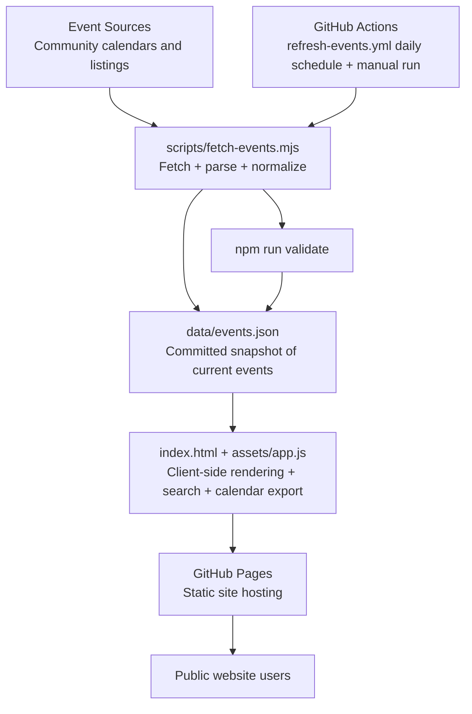
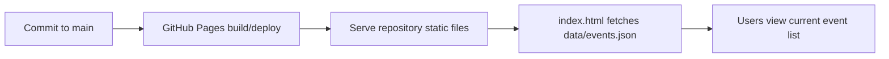

# Architecture Overview

This document explains how **TuscaloosaEvents** works end-to-end in a beginner-friendly way.

The project is a **static-site event aggregator**:
- data is collected by scripts,
- saved as JSON in the repository,
- and served directly by GitHub Pages.

No backend server is required for public visitors.

## 1) High-level system diagram

## 2) Data flow: from sources to `data/events.json`

The pipeline is implemented in `scripts/fetch-events.mjs`.

### Source ingestion
The script pulls event data from multiple public community sources.

It uses a mix of parsing strategies depending on each source format:
- JSON-LD extraction,
- HTML parsing with regex/text cleanup,
- ICS calendar parsing,
- and fetch fallbacks (including `curl`) when needed.

### Normalization and cleanup
After source fetches complete:
1. Results are merged.
2. Events are normalized to a common shape.
3. Duplicates are reduced.
4. Events are sorted by date.
5. Past events are filtered out.

### Weather enrichment (best effort)
The script also requests forecast data from `api.weather.gov` and attaches weather summaries to matching event dates when available.

If weather or a source fails, the pipeline **does not hard-fail the whole output**; warnings are recorded.

### Output structure
The script writes `data/events.json` with:
- `updatedAt`, `timezone`, and source metadata,
- optional weather metadata,
- `warnings` for partial failures,
- final normalized `events` array.

This keeps the frontend simple: it only needs to read one JSON file.

## 3) Validation flow

Validation is run with:
- `npm run validate`

In automation, validation runs after fetch and before committing refreshed data.

Conceptually:
1. Fetch data
2. Validate generated JSON and structure
3. Commit updated `data/events.json` if changed

## 4) GitHub Actions automation

Automation is defined in `.github/workflows/refresh-events.yml`.

The workflow:
1. Runs on a daily cron schedule (and supports manual dispatch).
2. Sets up Node.js.
3. Runs:
   - `npm run fetch`
   - `npm run validate`
4. Auto-commits `data/events.json` when refreshed.

This keeps event data current without adding backend infrastructure.

## 5) Deployment flow (GitHub Pages)

Because data is committed into the repo, deployment stays static and predictable.

## 6) Static-site design philosophy

TuscaloosaEvents intentionally favors:
- **clarity** over complexity,
- **committed data** over runtime infrastructure,
- **beginner-readable workflows** over heavy tooling.

Why this helps:
- easier onboarding for new contributors,
- fewer moving parts to debug,
- low-maintenance hosting on GitHub Pages.

## 7) Failure tolerance philosophy

The project prefers **graceful degradation**:
- If one source fails, other sources can still produce useful output.
- If weather enrichment fails, events still publish.
- Pipeline warnings are captured for transparency.

This supports reliability and keeps the site useful even during partial outages.

## 8) Quick contributor mental model

If you are new to the repo, think of it as:
1. **Collect** events (`scripts/fetch-events.mjs`)
2. **Normalize + validate** into `data/events.json`
3. **Render** events in a static webpage (`index.html` + `assets/app.js`)
4. **Refresh automatically** with GitHub Actions
5. **Publish statically** via GitHub Pages
